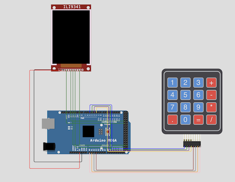
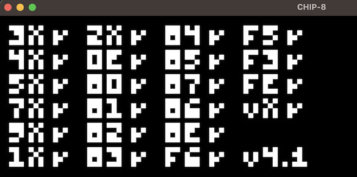

# [CHIP-8](https://en.wikipedia.org/wiki/CHIP-8) Handheld

The goal of this project is to ultimately have a physical handheld device that runs pre-loaded games run on our CHIP-8 emulator. 

## Current Objectives
- [x] Implement basic CHIP-8 instruction set in C 
- [x] Implement a basic CHIP-8 desktop application for debugging purposes
- [x] Have the CHIP-8 implementation compile to a microcontroller
- [ ] Prototype a full device that runs the CHIP-8 emulator
  - [ ] With display peripheral implemented
  - [ ] With audio peripheral implemented
  - [ ] With keypad peripheral implemented
- [ ] Write a launcher that allows the users to select ROMs from external memory (e.g. SD card) to be emulated
- [ ] Build the device 

Stretch goals:
- [ ] Extend our implementation to support Super CHIP-8 instructions
- [ ] A network component to our launcher that allows us to fetch ROMs from an online repository
- [ ] Use something like [Octo](https://github.com/JohnEarnest/Octo) to develop an original title for CHIP-8

## Project Components

    .
    ├── ...
    ├── src                     # Top level of the project's code 
    │   ├── app                 # Code particular to running the desktop application implementing our CHIP-8 library
    │   ├── arduino             # Code for the embedded (currently Arduino) implementation of our CHIP-8 device
    │   ├── chip8               # Library code for our CHIP-8 implementation 
    │   └── test                # Test suite for testing functionality and behaviors of our CHIP-8 library 
    ├── diagram.json            # Wokwi circuit/connection diagram for our physical embedded device
    ├── Makefile                # The Makefile for building our app and test suite 
    ├── platformio.ini          # The PlatformIO configuration file - used for building and managing the embedded device's code
    ├── wokwi.toml              # The Wokwi simulator configurations for our project 
    └── ...

### Handheld / Embedded Device

Presently, we're using [Wokwi](https://wokwi.com) to prototype and emulate our physical CHIP-8 handheld. 
As of right now, we're using an Arduino Mega as our microcontroller of choice. Though this, along with peripherals, are likely to change. A full bill of materials will be provided at a later time. 

To facilitate the embedded software development, we've opted to use [PlatformIO](https://platformio.org/). The hope is to keep our project more portable if/when we do move away from an Arduino based microcontroller.

To build the embedded code:
1. Install the [PlatformIO](https://platformio.org/platformio-ide) extension for VSCode.
2. From the PlatformIO extension select `PIO HOME -> Open` and select the root of this project directory.
3. If not automatically installed, refer to `platformio.ini` to determine which boards need to be downloaded in the PlatformIO extension.
4. Likewise, if not automatically installed, refer to `platformio.ini` to determine which libraries need to be installed in the PlatformIO extension.
5. From the PlatformIO extension navigate to the "Project Tasks" pane and click the "Build" task.
6. If successful, the task should generate a `firmware.elf` file at `.pio/megaatmega2560/`

To run the firware in the Wokwi Simulator:

Note: You must have an active subscription to [Wokwi Club](https://wokwi.com/club?ref=docs_club) in order to use the VSCode extension
1. Install the [Wokwi Extension](https://marketplace.visualstudio.com/items?itemName=wokwi.wokwi-vscode) VSCode extension
2. Provide your Wokwi license according to their [guide](https://docs.wokwi.com/vscode/getting-started#installation)
3. From the editor, open `diagram.json` and you should be able to view the simulated electronics
4. Press the green start button to begin the simulation (this should automatically select the aforementioned firmware file)

#### Adding ROMs
We compile a number of CHIP-8 games into our build. This is done programatically by the make task `build_roms`. 
1. Add the games you wish to add to your build to the directory: `roms/games/`
2. Run `make build_roms`
3. Re-build the embedded code (see above)

Note: You may first need to run, `make clean`. Additionally, this has only been tested on Mac, but the host system would need to have [xxd](https://linux.die.net/man/1/xxd) to run.

#### Bill of Materials

| Item Name     | Qty           |
| ------------- | ------------- |
| [Keypad](https://www.amazon.com/gp/product/B0CPHVNXZQ/ref=ewc_pr_img_1?smid=A38CU2XC1RY0BO&psc=1)        | 1             |
| [Display](https://www.amazon.com/gp/product/B0CG39ZH7V/ref=ewc_pr_img_1?smid=A2UYBS1CH53PM5&psc=1)       | 1             |

### Desktop App 

Note: The desktop application has only been tested on MacOS at this time. 

Presently, the desktop application uses [cSFML](https://www.sfml-dev.org/download/csfml/) for rendering, audio, and input handling.

To run the desktop version of the application:
1. Install and properly link cSFML 2.6.1
2. Install Make (if not already installed)
3. Run `make` 
4. Run the application with a chip8 program as an argument `./chip8 program.ch8` (you can use `roms/test/3-corax+.ch8` as a basis)

### Test Suite
This is an application that runs a series of tests against the functionality of our CHIP-8 implementation

To build and run the test suite:
1. Install Make (if not already installed)
2. Run `make test_chip8`
3. Run the test suite `./test_chip8` to verify core functionality of the CHIP-8 implementation

Note: These tests are not exhaustive.
